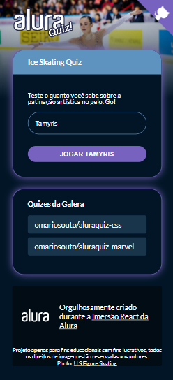
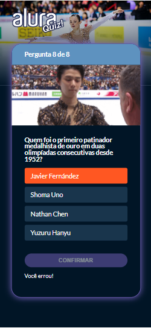
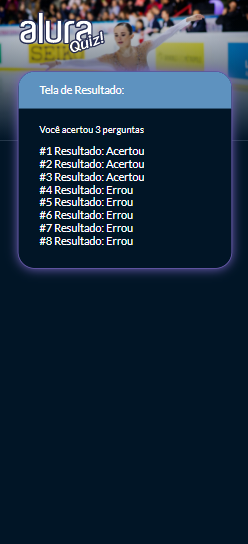

<h1 align="center"> AluraQuiz - Ice Skating </h1>

<div align="center">


</div>

<h3 align="center">Seja bem vindo ao projeto do AluraQuiz! </h3>

<div align="center"> 
  <a href="https://gitmoji.dev">
      
   </a>
</div>

## Sobre 
Projeto desenvolvido durante a irmersão React Nextjs (2021) da <a href="https://www.alura.com.br/"> Alura </a> de uma página de quiz que também consome a API de outros quizes. 

Utiliza conceitos do desenvolvimento web FrontEnd. Os dados do quiz estão armazenados em um arquivo JSON.

Na página inicial, depois que o usuário digita o nome, o **botão para iniciar** o quiz é habilitado.

É mostrado o **total de perguntas** do quiz e qual a pergunta atual.
O **botão de confirmar** resposta e ir para a próxima pergunta só é liberado após umas das alternativas de resposta ser escolhida.
Se o usuário escolher a **alternativa correta**, ela é sinalizada com **verde** e com a mensagem **'Você acertou!'**.
Senão, a **alternativa errada** é sinalizada com **vermelho** e com a mensagem **'Você errou!'**.

No final, é mostrado uma **tela de resultado** com o **total de acertos** e quais perguntas o usuário acertou e errou.


## Tecnologias
- [NextJS](https://github.com/vercel/next.js/tree/canary/examples/with-styled-components)
- [ReactJS](https://pt-br.reactjs.org/)
- [styled-components](https://styled-components.com/)
- [prop-types](https://www.npmjs.com/package/prop-types)
- [framer-motion](https://www.framer.com/motion/)

## Preview
 ### Mobile
<p align="center">
  <span>
    
  </span>
 
  <span>
    
  </span>
 
  <span>
    
  </span>
</p>

## Como usar
### Pré-requisitos
- [Git](https://git-scm.com)
- [Node.js](https://nodejs.org/en/) 
- [Yarn](https://www.notion.so/Instala-o-das-ferramentas-1c09af201b4b49c5bf1678842a96d9ab)

### Rodando a aplicação localmente

```bash
# Clone este repositório
$ git clone https://github.com/tamyrisoliveira/alura-quiz.git

# Acesse a pasta do projeto no terminal/cmd
$ cd alura-quiz

# Instale as dependências
$ npm install

ou

$ yarn install

# Execute a aplicação em modo de desenvolvimento
$ npm run dev

ou

$ yarn dev

# O servidor inciará na porta:3000 - acesse <http://localhost:3000>
```

## Instrutores
<table>
  <tr>
    <td align="center"><a href="https://github.com/omariosouto"><br /><sub><b>Mario Souto</b></sub></a> </td>
    <td align="center"><a href="https://github.com/JulianaAmoasei"><br /><sub><b>Juliana Amoasei</b></sub></a><br /></td>
    <td align="center"><a href="https://github.com/peas"><br /><sub><b>Paulo Silveira</b></sub></a></td>
</table>

## Licença
Esse projeto está sob a licença [MIT](LICENSE)
